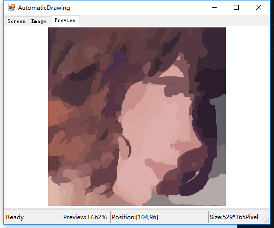
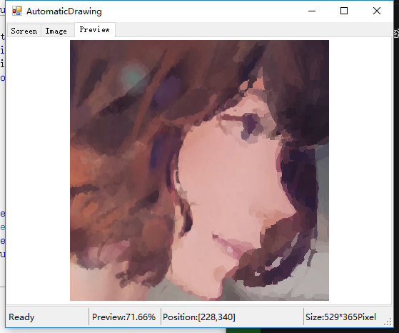
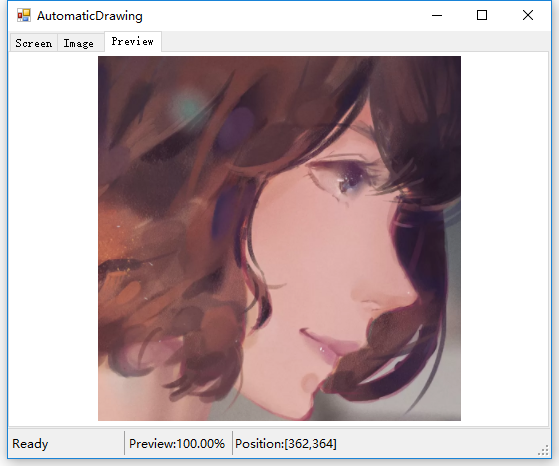

Translation：[English](./README.md)

## AutomaticDrawing是什么?
一个实现自动绘图的程序，提供它一块画板与鼠标，就能为你画出美丽的图形

- 快速识别

- 层次聚类

## AutomaticDrawing有哪些功能？

* 图像来源
    *  本地文件
    *  屏幕快照   
* 图像处理
    *  二值化处理，阈值手动可调
    *  轮廓化处理，阈值手动可调
    *  空心处理   
* 额外的功能
    *  绘制签名
    *  绘制预览
    *  一键绘图  

## 视频演示
* 演示1：[AutomaticDrawing_花鸟](http://v.youku.com/v_show/id_XMTUwNTI5MTAwMA==.html)
* 演示2：[AutomaticDrawing_人物](http://v.youku.com/v_show/id_XMTUwNjI2NzkwOA==.html)
* 演示3：[AutomaticDrawing_山水](http://v.youku.com/v_show/id_XMTUwODg2MTUxNg==.html)
* 演示4：[AutomaticDrawing_雄狮](http://v.youku.com/v_show/id_XMTUxNDk5OTgxNg==.html)

## 版本更新
* 新的版本！全新的算法与更加高效的图形引擎，[点击查看](https://github.com/experdot/ExperDot.EDGameEngine/tree/master/EDGameEngine.Visuals/GameObject/GameVisual/AutoDraw).

## 联系方式
* 邮件：experdot@foxmail.com
* 博客园: [@ExperDot](http://www.cnblogs.com/experdot/)
